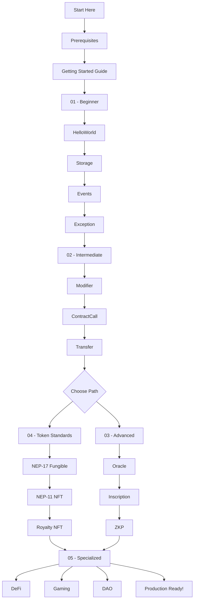

# NEO Smart Contract Learning Path

This guide provides a structured learning path for mastering NEO smart contract development.

## 🎯 Learning Journey

## 📚 Detailed Learning Path

### Phase 1: Foundation (1-2 weeks)
**Goal**: Understand NEO smart contract basics

1. **Setup Environment**
   - Install .NET SDK
   - Clone neo-devpack-dotnet
   - Run first example

2. **Complete Beginner Examples**
   - [ ] HelloWorld - Basic contract structure
   - [ ] Storage - Data persistence
   - [ ] Events - Contract communication
   - [ ] Exception - Error handling

### Phase 2: Core Concepts (2-3 weeks)
**Goal**: Master essential smart contract patterns

3. **Complete Intermediate Examples**
   - [ ] Modifier - Access control
   - [ ] ContractCall - Contract interaction
   - [ ] Transfer - Asset management

4. **Choose Your Track**
   - **Token Developer**: Go to Phase 3A
   - **Advanced Developer**: Go to Phase 3B

### Phase 3A: Token Development (2-3 weeks)
**Goal**: Create standard-compliant tokens

5. **Token Standards**
   - [ ] NEP-17 - Fungible tokens
   - [ ] NEP-11 - Non-fungible tokens
   - [ ] Royalty NFT - Advanced NFT features

### Phase 3B: Advanced Features (3-4 weeks)
**Goal**: Implement complex features

6. **Advanced Examples**
   - [ ] Oracle - External data
   - [ ] Inscription - On-chain data
   - [ ] ZKP - Privacy features

### Phase 4: Specialization (4-6 weeks)
**Goal**: Build production-ready applications

7. **Choose Specialization**
   - [ ] DeFi - Financial protocols
   - [ ] Gaming - Game mechanics
   - [ ] DAO - Governance systems

8. **Production Preparation**
   - [ ] Security audit preparation
   - [ ] Gas optimization
   - [ ] Testnet deployment
   - [ ] Documentation

## 🎓 Skill Progression

### Beginner Skills
- ✅ Write basic smart contracts
- ✅ Use contract storage
- ✅ Emit and handle events
- ✅ Basic error handling

### Intermediate Skills
- ✅ Implement access control
- ✅ Call other contracts
- ✅ Handle asset transfers
- ✅ Write comprehensive tests

### Advanced Skills
- ✅ Integrate external data
- ✅ Implement privacy features
- ✅ Optimize gas usage
- ✅ Design complex systems

### Expert Skills
- ✅ Build DeFi protocols
- ✅ Create gaming economies
- ✅ Design governance systems
- ✅ Audit and secure contracts

## 📖 Study Tips

### For Each Example:
1. **Read** the README and source code
2. **Run** the tests to see it in action
3. **Modify** the code to experiment
4. **Build** something similar from scratch
5. **Share** your learnings with the community

### Time Estimates:
- **Beginner**: 2-4 hours per example
- **Intermediate**: 4-6 hours per example
- **Advanced**: 6-10 hours per example
- **Specialized**: 1-2 weeks per category

## 🏆 Milestones

### 🥉 Bronze (Beginner Complete)
- Completed all beginner examples
- Can write basic smart contracts
- Understands storage and events

### 🥈 Silver (Intermediate Complete)
- Completed all intermediate examples
- Can build interactive contracts
- Understands security basics

### 🥇 Gold (Advanced Complete)
- Completed advanced examples or token standards
- Can implement complex features
- Ready for production development

### 💎 Diamond (Specialized Complete)
- Completed specialized examples
- Can architect complex systems
- Contributing to the ecosystem

## 🚀 Next Steps After Completion

1. **Build Your Own Project**
   - Identify a real problem to solve
   - Design the architecture
   - Implement and test
   - Deploy to testnet

2. **Contribute to NEO**
   - Submit example improvements
   - Create new examples
   - Help other developers
   - Report issues

3. **Join the Community**
   - [Discord](https://discord.gg/rvZFQ5382k)
   - [GitHub](https://github.com/neo-project)
   - [Reddit](https://reddit.com/r/NEO)

## 📚 Additional Resources

- [NEO Documentation](https://docs.neo.org/)
- [Security Best Practices](../docs/security/)
- [Gas Optimization Guide](../docs/gas-optimization.md)
- [Production Checklist](../docs/production-checklist.md)

---

Remember: The journey to becoming a NEO smart contract expert is a marathon, not a sprint. Take your time, understand each concept thoroughly, and don't hesitate to ask for help in the community!