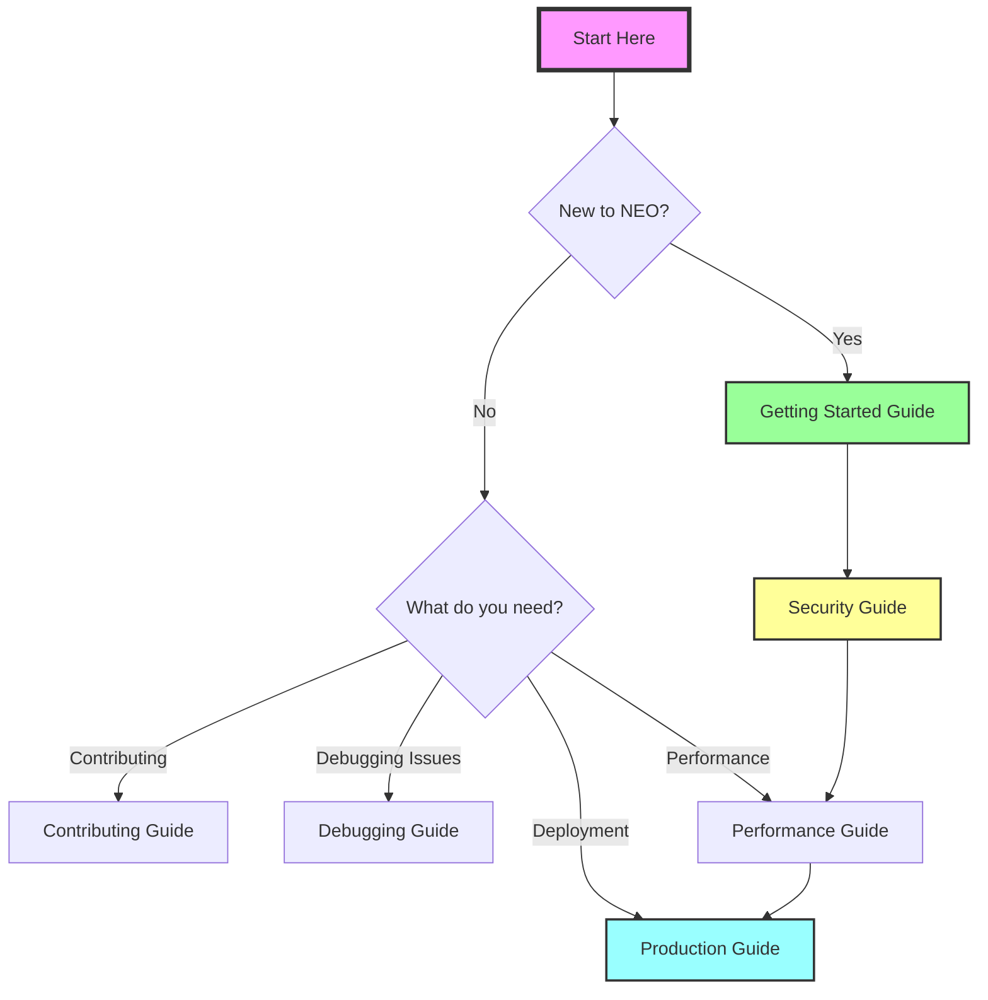
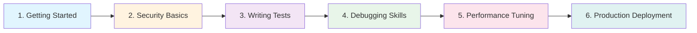

# NEO Smart Contract Development Guidance

> **Version**: 1.0.0 | **Last Updated**: January 2025 | **Compatible with**: NEO N3

This directory contains comprehensive, enterprise-grade guidance documents for NEO smart contract development. These guides incorporate the latest enhancements, security best practices, and performance optimization techniques.

## 🎯 Quick Navigation

## 📚 Available Guides

### 1. [Contributing Guide](CONTRIBUTING-GUIDE.md)
Complete guide for contributing to the NEO DevPack project, including:
- Development workflow and branch strategy
- Commit message conventions
- Pull request process
- Performance guidelines
- Dependency management

### 2. [Getting Started Guide](GETTING-STARTED-GUIDE.md)
Comprehensive introduction to NEO smart contract development:
- Development environment setup
- Local blockchain setup (Neo Express, Docker, Neo CLI)
- Your first smart contract
- IDE configuration (VS Code, Visual Studio, Rider)
- Common development patterns
- Testing and deployment

### 3. [Production Deployment Guide](PRODUCTION-DEPLOYMENT-GUIDE.md)
Complete checklist and procedures for mainnet deployment:
- Pre-deployment security review
- Operational runbooks
- Monitoring and alerting setup
- Network-specific considerations
- Governance and compliance
- Emergency response procedures

### 4. [Security Implementation Guide](SECURITY-IMPLEMENTATION-GUIDE.md)
Practical security patterns and implementations:
- Input validation frameworks
- Access control patterns
- Oracle security
- Randomness security
- Denial of Service protection
- Testing strategies

### 5. [Debugging Guide](DEBUGGING-GUIDE.md)
Comprehensive debugging techniques and tools:
- Development-time debugging
- Testing and debugging strategies
- Common error messages and solutions
- Debugging tools (Neo Express, Neo CLI)
- Troubleshooting checklist

### 6. [Performance Optimization Guide](PERFORMANCE-OPTIMIZATION-GUIDE.md) 🆕
Advanced techniques for optimizing smart contract performance:
- Gas optimization strategies
- Storage optimization patterns
- Computational efficiency
- Batch operations
- Performance testing and benchmarks

### 7. [Quality Assurance Report](QUALITY-ASSURANCE-REPORT.md)
Comprehensive quality assessment and validation results for all documentation.

## 🚀 Quick Start

If you're new to NEO development:
1. Start with the [Getting Started Guide](GETTING-STARTED-GUIDE.md)
2. Review the [Security Implementation Guide](SECURITY-IMPLEMENTATION-GUIDE.md)
3. Use the [Debugging Guide](DEBUGGING-GUIDE.md) when you encounter issues
4. Follow the [Production Deployment Guide](PRODUCTION-DEPLOYMENT-GUIDE.md) before mainnet deployment

## 🤝 Contributing

To contribute to these guides:
1. Read the [Contributing Guide](CONTRIBUTING-GUIDE.md)
2. Follow the development workflow outlined there
3. Submit improvements via pull requests

## 📋 Quality Standards

All guides meet enterprise-grade standards for:
- **Completeness** - Full topic coverage with runnable examples
- **Correctness** - NEO N3 compatible, technically accurate
- **Clarity** - Clear explanations with visual aids
- **Consistency** - Uniform formatting and terminology

## 🔄 Version History

| Version | Date | Changes |
|---------|------|---------|
| 1.0.0 | January 2025 | Initial release with comprehensive guides |
| | | • Added Performance Optimization Guide |
| | | • Enhanced Security Implementation Guide |
| | | • Added operational runbooks |
| | | • Included debugging techniques |

## 📊 Quick Reference

| Need | Guide | Difficulty |
|------|-------|------------|
| Setup environment | [Getting Started](GETTING-STARTED-GUIDE.md) | 🟢 Beginner |
| Write secure code | [Security](SECURITY-IMPLEMENTATION-GUIDE.md) | 🟡 Intermediate |
| Optimize performance | [Performance](PERFORMANCE-OPTIMIZATION-GUIDE.md) | 🔴 Advanced |
| Fix issues | [Debugging](DEBUGGING-GUIDE.md) | 🟡 Intermediate |
| Deploy to production | [Production](PRODUCTION-DEPLOYMENT-GUIDE.md) | 🔴 Advanced |
| Contribute code | [Contributing](CONTRIBUTING-GUIDE.md) | 🟡 Intermediate |

## 🎓 Learning Path

## 🤝 Feedback and Contributions

We welcome feedback and contributions to improve these guides:

- **Report Issues**: [GitHub Issues](https://github.com/neo-project/neo-devpack-dotnet/issues)
- **Suggest Improvements**: Submit PRs following our [Contributing Guide](CONTRIBUTING-GUIDE.md)
- **Join Discussion**: [NEO Discord](https://discord.gg/rvZFQ5382k)

---

**Remember**: These guides are living documents. Check back regularly for updates and improvements.